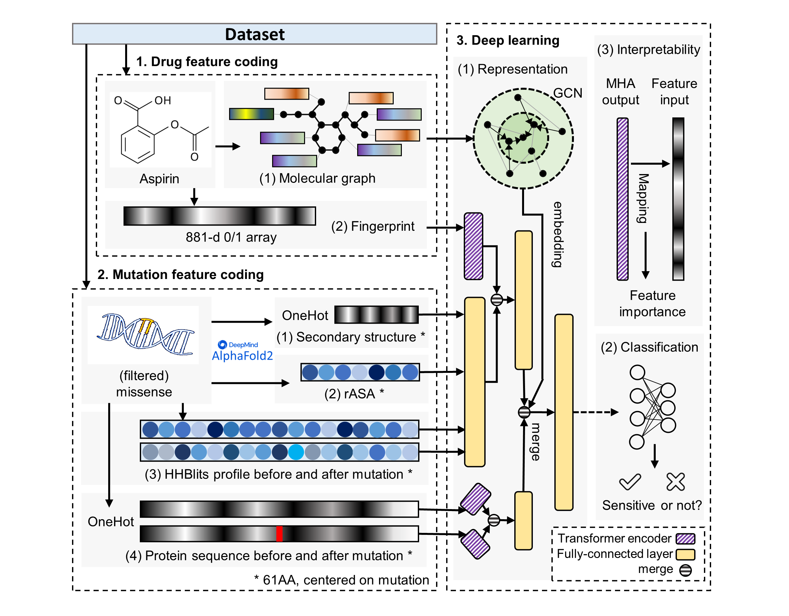

# Emden
Predicting the effect of mutations on clinical drug response using deep learning

<p align="center"></p>

## Environment
- Python == 3.9
- Pytorch == 1.12
- Scikit-learn == 1.1

## Evaluate model
We provide the test dataset used in this study,  you can use [test_data.pt](https://github.com/Liuzhe30/Emden/tree/main/datasets/processed/test_data.pt) in pytorch format or [testset.csv](https://github.com/Liuzhe30/Emden/tree/main/datasets/testset.csv) in .csv format to evaluate our method.
The trained model weights can be downloaded from [OneDrive url](https://1drv.ms/u/s!AjoZI2sogng56AGLbcxX5F_40RRo?e=HEwpOh).
```
python evaluation.py
```

## Prepare dataset
### Requiements
- [HH-suite](https://github.com/soedinglab/hh-suite) for generating HHblits files from protein sequences (with the file suffix of .hhm)
- [Alphafold2](https://github.com/deepmind/alphafold) for generating PDB files from protein sequences (with the file suffix of .pdb)
- [DSSP](https://github.com/cmbi/dssp) for generating DSSP files from pdb files (with the file suffix of .dssp)
### Prepare data in pytorch format
```
cd /src
python prepareData.py
```
